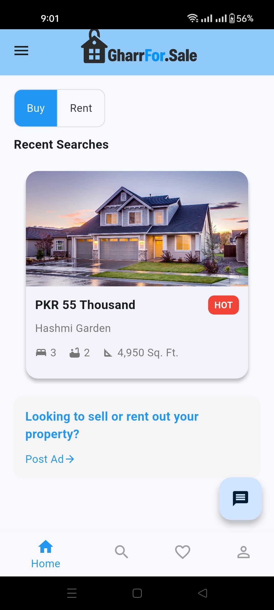
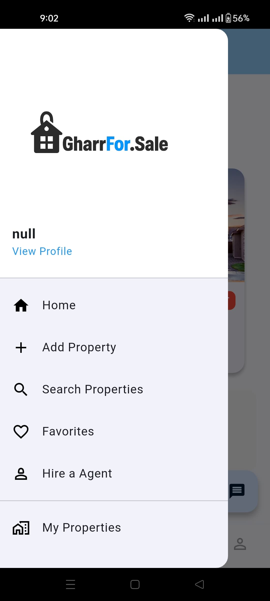
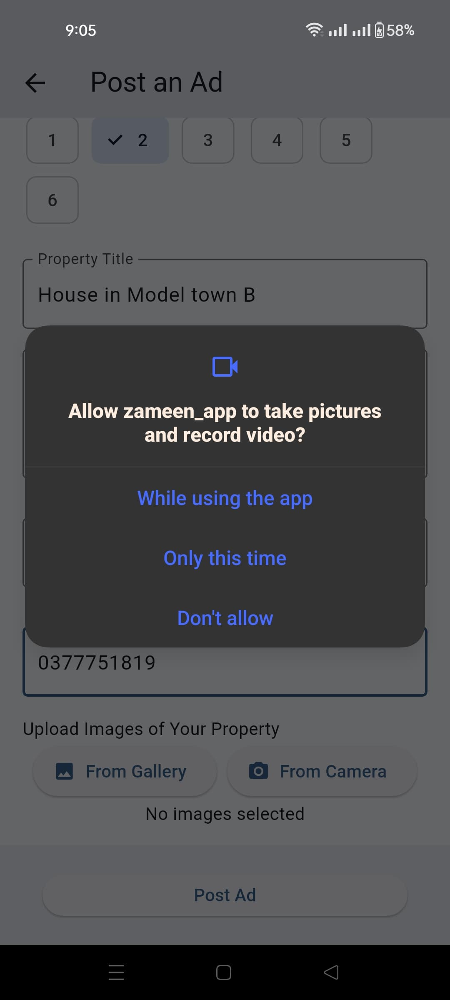

# Zameen_app
Buying and selling real estate app.

<table>
  <tr>
    <td align="center">
      <h2>SignUp Screen</h2>
      <h3>Users SignUp on this Screen.<h3>
      
    </td>
    <td align="center">
      <h2>Login Screen</h2>
       <h3>Already SignedUp Users can directly Login.<h3>
      
    </td>
  </tr>
</table>

<table>
  <tr>
    <td align="center">
      <h2>HomeScreen</h2>
      <h3>HomeScreen of the app giving access to all the functionalities.<h3>
      
    </td>
    <td align="center">
      <h2>Drawer</h2>
       <h3>Drawer on HomeScreen Giving quick access to all the screens.<h3>
      
    </td>
  </tr>
</table>

<table>
  <tr>
    <td align="center">
      <h2>Post Ad Screen</h2>
      <h3>Add Properties that you want to Sell.<h3>
      
    </td>
    <td align="center">
      <h2>Post Ad Screen</h2>
       <h3>Add Properties that you want to Sell.<h3>
      
    </td>
  </tr>
</table>

<table>
  <tr>
    <td align="center">
      <h2>Permission Handler</h2>
      <h3>Takes permission before accessing your photo library.<h3>
      
    </td>
    <td align="center">
      <h2>MemberShip Screen</h2>
       <h3>Take MemberShip if you want to become a gold member.<h3>
      
    </td>
  </tr>
</table>

<table>
  <tr>
    <td align="center">
      <h2>Add Card Screen</h2>
      <h3>Add Card to pay for the Gold MemberShip.<h3>
      
    </td>
    <td align="center">
      <h2>AI Chat Screen</h2>
       <h3>Ai chatbot has also been integrated.<h3>
      
    </td>
  </tr>
</table>

<table>
  <tr>
    <td align="center">
      <h2>AI Chat Screen</h2>
      <h3>Shows working of ChatBot.<h3>
      
    </td>
      </tr>
      </table>

